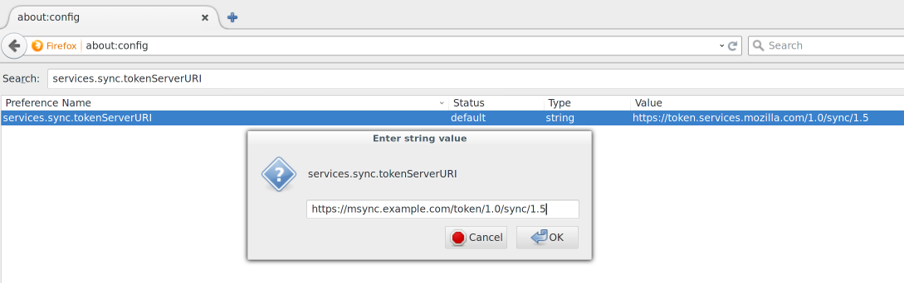

Mozilla Sync Server, Synchronizing Your Firefox Across Devices
==============================================================

*uses dnsmasq MariaDB and Nginx*

`Mozilla Sync Server`_ is an Internet service which synchronize your Firefox (e.g. bookmarks, history, etc) across
devices. By default, Firefox uses the sync server set up by Mozilla, but Mozilla has also released the sync server which
we can use our own server for synchronization.

*Note that the setup here uses the Mozilla hosted accounts server at https://accounts.firefox.com*

Configure DNS
-------------

Store the domain we will use for the Mozilla sync service (remember to replace ``msync.example.com`` with your domain
name):
::

   MY_DOMAIN=msync.example.com

We will use ``MY_DOMAIN`` to refer to the domain name we need to use in shell commands through this section.

You should also add an ``A`` record that points your domain to the IP address of the server.

Configure the MariaDB Database
------------------------------

Please follow the instructions in :doc:`../common-tasks/add-mariadb-database` to create a new user and a database both
named as ``msync`` in MariaDB.

Configure Mozilla Sync Server
-----------------------------

Create a directory for Mozilla sync server:
::

   sudo mkdir $DOCKER_SHARE/msync
   cd $DOCKER_SHARE/msync

Pull the Mozilla sync server image and generate the default configuration file:
::

   docker pull blowb/mozilla-sync-server
   sudo -s <<< "docker run --rm blowb/mozilla-sync-server \
    cat /var/uwsgi/syncserver.ini > syncserver.ini"

The Dockerfile from which the image was generated is `available
<https://registry.hub.docker.com/u/blowb/mozilla-sync-server/dockerfile/>`_.

Modify the default configuration file by running the following command, after replacing ``PASSWORD`` with the password
you have just set for msync user in the MariaDB database:

.. code-block:: bash
   :linenos:

   sudo sed -ri \
    -e "s/^(public_url = ).*\$/\1https:\/\/$MY_DOMAIN/" \
    -e 's/#sqluri =.*$/sqluri = pymysql:\/\/msync:PASSWORD@db\/msync/' \
    syncserver.ini

Explanation:

  - **line 2**: set the public url as what we will serve as;
  - **line 3**: set the sql database to what we have just set up earlier in `Configure the MariaDB Database`_ .

Start the Mozilla sync server container:
::

   docker run -d --restart always --name msync --dns $HOST_ADDR \
    --env NUM_PROCESSES=1 --env NUM_THREADS=2 \
    -v $DOCKER_SHARE/msync/syncserver.ini:/etc/syncserver.ini:ro \
    blowb/mozilla-sync-server

You may adjust ``NUM_THREADS`` and ``NUM_PROCESSES`` depending on your need, but for a small website, ``NUM_THREADS=2``
and ``NUM_PROCESSES=1`` should be enough.

Configure Nginx
---------------

Run the following command to generate a configuration file which would make Nginx pass all requests to your sync server
URL to the Mozilla sync server container under the uWSGI protocol:
::

   cd $DOCKER_SHARE/nginx
   sudo -s <<EOF
   sed -e "s/@server_name@/$MY_DOMAIN/g" \
    redirect-https.conf.tmpl > msync.conf
   sed -e "s/@server_name@/$MY_DOMAIN/g" \
    -e 's/@uwsgi_server@/msync:9000/g' uwsgi.tls.conf.tmpl > msync.tls.conf
   EOF

Note here we do not use the http version as it is insecure to transfer your bookmark, history, etc. in plain text over
the Internet. Edit the ``msync.tls.conf`` file to replace dummy key and certificate if you don't want to use the dummy
ones.

Restart the Nginx container:
::

   systemctl restart nginx

Configure Firefox
-----------------

Before we start configuring, if you chose to use the dummy key, we need to add a security exception in Firefox. Visit
the URL ``https://msync.example.com`` in your Firefox browser, where ``msync.example.com`` is your Mozilla sync server
domain. In the "This Connection is Untrusted" page, click ``I Understand the Risks``, then the ``Add Exception...``
button. Make sure the ``Permanently store this exception`` is checked, then click the ``Confirm Security Exception``
button.

To make your Firefox uses the synchronize server we have just set up, first log out your Mozilla account if you have
logged in. Then type ``about:config`` in the navigation bar and press Enter. If a button with the text ``I'll be
careful, I promise!`` shows up, click on it. Now you should be at a page with a list of options and a search bar on the
top. Use the search bar to search for ``services.sync.tokenServerURI``, and change the value of this option to
``https://msync.example.com/token/1.0/sync/1.5``, where ``msync.example.com`` should be replaced by your domain name
used for Mozilla sync server, similar to what is shown in :numref:`mozilla-sync-firefox`. Now logging into your Firefox
account should make Firefox use the synchronize server we have just set up.

.. _mozilla-sync-firefox:

   Configure Firefox to use our own server.

Verify Whether the Setup Works
------------------------------

To verify the setup works, we can see if the database has added new records for our Firefox browsers. Run the following
commands on your server:
::

   ne mariadb
   # Now inside the MariaDB container
   mysql -u root msync -p

Enter the password and run the following SQL query in the MariaDB shell:

.. code-block:: sql

   select * from users;

If a non-empty table is displayed, then the setup was successfully done.

Press ``Ctrl-D`` twice to exit to the host Bash shell.

Disable New Users Signups
-------------------------

After everyone relevant have logged in with their Firefox, you may not want new users to sign up in your server. To
disable new users signups, edit ``$DOCKER_SHARE/msync/syncserver.ini`` to uncomment the ``allow_new_user = false`` line,
or run the following command:
::

   sudo sed -ri 's/^# (allow_new_users = false)/\1/' \
    $DOCKER_SHARE/msync/syncserver.ini

Restart relevant Docker containers to take effect:
::

   docker restart msync nginx

.. _Mozilla Sync Server: https://github.com/mozilla-services/syncserver
