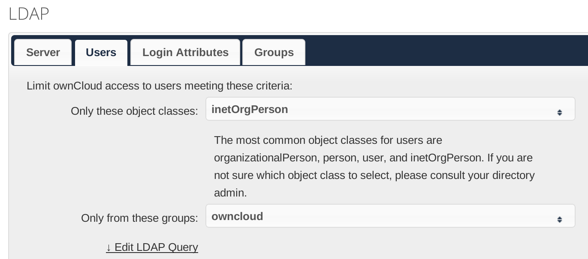
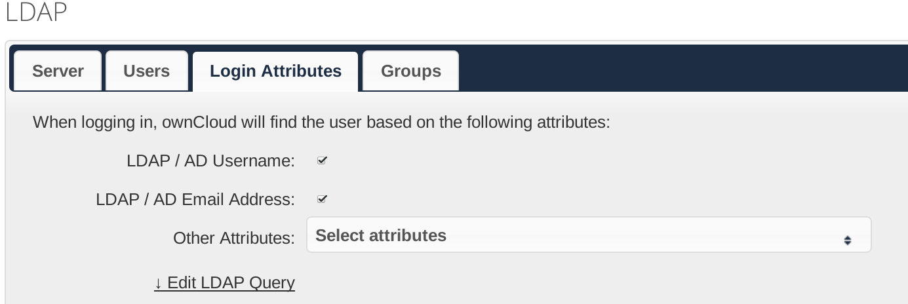
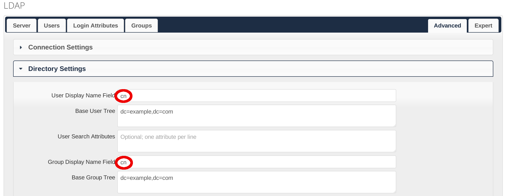

OwnCloud, A File Synchronization and Cloud Service
==================================================

*Uses a data container, dnsmasq, MariaDB, Nginx, OpenLDAP and Postfix*

`Owncloud`_ is a free, open source, Dropbox-like file synchronization and cloud service.

Configure DNS
-------------

Add an ``A`` record to point the domain that you want to use with ownCloud to the IP address of the server.

Configure the MariaDB Database
------------------------------

Follow the instructions in :doc:`../common-tasks/add-mariadb-database` to create a new user and a database both named as
``owncloud`` in the MariaDB database.

Set up OwnCloud Container
-------------------------

Create a data container for ownCloud:
::

   docker run -v /var/www/html --name owncloud-data busybox /bin/true

To start the ownCloud container, run the following command:
::

   docker run -d --restart always --name owncloud --dns $HOST_ADDR \
    --add-host smtp-server:$HOST_ADDR --volumes-from owncloud-data blowb/owncloud

The Dockerfile from which the image was generated is `available
<https://hub.docker.com/r/blowb/owncloud/~/dockerfile/>`_. For the first time the container starts, it will download and
decompress the ownCloud installation to ``/var/www/html/``.

Configure Nginx
---------------

Now run the following command to set up Nginx, after replacing ``owncloud.example.com`` with the domain to be used by
ownCloud:
::

   cd $DOCKER_SHARE/nginx
   OWNCLOUD_URL='owncloud.example.com'
   sudo -s <<EOF
   sed -e "s/@server_name@/$OWNCLOUD_URL/g" redirect-https.conf.tmpl > owncloud.conf
   sed -e "s/@server_name@/$OWNCLOUD_URL/g" \
    -e 's/@web_server@/owncloud:80/g' reverse-proxy.tls.conf.tmpl > owncloud.tls.conf
   EOF

Optionally we can edit ``owncloud.tls.conf`` to use a different TLS/SSL key instead of the dummy key.

Recreate and restart the Nginx container:
::

   docker restart nginx

Basic Configuration of OwnCloud
-------------------------------

Visit the ownCloud instance in a browser (e.g. ``https://owncloud.example.com``), and follow the instructions to set up
ownCloud. In the first-run setup page, the database type should be ``MySQL/MariaDB`` not ``SQLite``; the database server
is ``db``; database login is ``owncloud``; the database password is the one we generated earlier; the database name is
``owncloud``. The settings should look like :numref:`firstrun-setup`. Then click ``Finish setup`` to finish the initial
setup.

.. _firstrun-setup:

.. figure:: owncloud/firstrun-setup.png
   :alt: OwnCloud First Run Setup
   :scale: 40 %

   Set up ownCloud in the first run.

We should have now automatically logged into the admin account. Then we need to configure the email server for sending
notification. Click on the triangle on the right up corner, and click "Admin", as shown in :numref:`enter-admin`. This
should lead us to the admin interface.

.. _enter-admin:

.. figure:: owncloud/enter-admin.png
   :alt: Enter Admin
   :scale: 60%

   Enter admin interface.

In the admin interface, there is an "Email Server" section. In this section, ``Send mode`` should be set to ``smtp``;
``From address`` can be anything you like, such as ``owncloud@example.com``; ``Server address`` should be set to
``smtp-server``. The settings should look similar to :numref:`email-server`.

.. _email-server:

.. figure:: owncloud/email-server.png
   :alt: Email Server Settings

   Set email server.

Since we use reverse proxy for the ownCloud setup, we also need to configure ownCloud to recognize the reverse proxy by
running the following command on the host system (after replacing ``owncloud.example.com`` with the domain used by the
ownCloud instance):
::

   docker exec -i owncloud bash -c 'cat >>/var/www/html/config/config.php' <<'EOF'
   # reverse proxy settings
   $CONFIG = array_merge($CONFIG, array (
   "overwritehost"     => "owncloud.example.com",
   "overwriteprotocol" => "https",
   ));
   EOF

.. _use-owncloud-with-openldap:

Use OwnCloud with OpenLDAP
--------------------------

It is optional but recommended to use ownCloud with OpenLDAP. If you decide not to use ownCloud with OpenLDAP, you may
skip this part.

First, follow the instructions in :doc:`../common-tasks/group-tasks-openldap` to create a new group ``owncloud`` and add
all users who will be granted to use ownCloud to this group.

Now log in ownCloud with the admin account. On the left up corner, click on the small triangle next to the word
"Files", then click "Apps", as shown in :numref:`enter-apps`.

.. _enter-apps:

.. figure:: owncloud/enter-apps.png
   :alt: OwnCloud Enter Apps

   Enter "Apps" in ownCloud.

We should be in the "Apps" interface now. Click on "Not Enabled" on the left, and find "LDAP user and group backend" on
the right panel. Click on the "Enable" button to enable this LDAP backend ownCloud app, as shown in :numref:`apps`.

.. _apps:

.. figure:: owncloud/apps.png
   :alt: OwnCloud Apps

   Enable the LDAP backend app.

Enter the admin interface as shown in :numref:`enter-admin`.

In the admin interface, we are going to set up the LDAP server. In the "Server" tab, fill in the ``host`` field with
``ldap``, ``Base DN`` field with ``$LDAP_SUFFIX``, where ``$LDAP_SUFFIX`` should be replaced by the ``$LDAP_SUFFIX``
used in :doc:`../install-essential-docker/openldap`. ``User DN`` and ``Password`` should be left empty. The setup should
look like :numref:`ldap-server`.

.. _ldap-server:

.. figure:: owncloud/ldap-server.png
   :alt: LDAP "Server" Tab

   Fill in the "Server" tab in LDAP settings panel.

Fill in the "Users" tab as in :numref:`ldap-users` and the "Login Attributes" tab as in :numref:`ldap-login-attributes`.
In the "Login Attributes" tab, we may also add some other attributes as the user login. In the "Advanced" tab, the
``User Display Name Field`` and ``Group Display Name Field`` should be set to ``cn`` under "Directory Settings", as
shown in :numref:`ldap-displayname`. Other tabs can be left as default.

.. _ldap-users:

   Fill in the "Users" tab in LDAP settings panel.

.. _ldap-login-attributes:

   Fill in the "Login Attributes" tab in LDAP settings panel.

.. _ldap-displayname:

   Set the LDAP "User Display Name" and "Group Display Name".

Other Settings
--------------

We may adjust settings and enable more ownCloud apps. The way to add a new app into the ownCloud instance is similar to
adding the LDAP backend app as shown in :ref:`use-owncloud-with-openldap`. It is recommended to enable the `Calendar
<https://doc.owncloud.org/server/8.2/user_manual/pim/calendar.html>`_ and `Contacts
<https://doc.owncloud.org/server/8.2/user_manual/pim/contacts.html>`_ apps calendar and contacts synchronization.

Update OwnCloud
---------------

The ownCloud container used here is a self-managed php container, which means that all ownCloud files are downloaded and
stored in a data container during the ownCloud container's first run. To upgrade, we can use `ownCloud's Updater app
<https://doc.owncloud.org/server/8.2/admin_manual/maintenance/update.html>`_.

To manually update ownCloud, run the following command to enter the shell in the ownCloud container then switch to
``/var/www/html``:
::

   ne owncloud
   # Now in the owncloud container
   cd /var/www/html

Then follow `the official instructions by ownCloud
<https://doc.owncloud.org/server/8.2/admin_manual/maintenance/manual_upgrade.html>`_ to update.

.. _OwnCloud: https://owncloud.org
