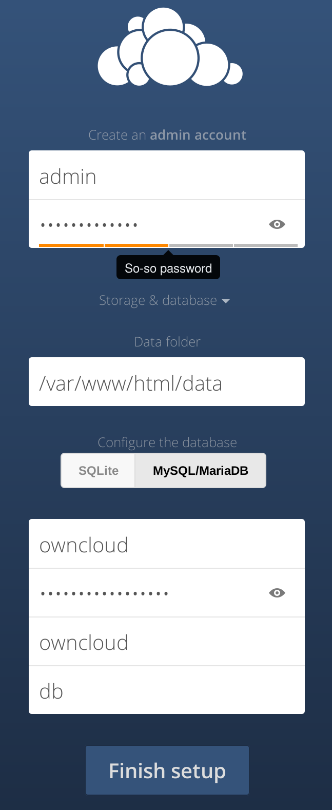

..  Copyright (c) 2015 Hong Xu <hong@topbug.net>

..  This file is part of Blowb.

    Blowb is a free document: you can redistribute it and/or modify it under the terms of the GNU General Public License
    as published by the Free Software Foundation, either version 2 of the License, or (at your option) any later
    version.

    Blowb is distributed in the hope that it will be useful, but WITHOUT ANY WARRANTY; without even the implied warranty
    of MERCHANTABILITY or FITNESS FOR A PARTICULAR PURPOSE.  See the GNU General Public License for more details.

    You should have received a copy of the GNU General Public License along with Blowb.  If not, see
    <http://www.gnu.org/licenses/>.

OwnCloud, A File Synchronization and Cloud Service
==================================================

`Owncloud`_ is a free, open source, Dropbox-like file synchronization and cloud service.

Configure DNS
-------------

Please add an A record to point the domain you want to use with ownCloud to the IP address of the server.

Configure the MariaDB Database
------------------------------

Please follow the instructions in :doc:`../common-tasks/add-mariadb-database` to create a new user and a database both
named as ``owncloud`` in MariaDB.

Set up OwnCloud Container
-------------------------

Create a data container for ownCloud:
::

   docker run -v /var/www/html --name owncloud-data busybox /bin/true

To start the ownCloud container, run the following command:
::

   docker run -d --restart always --name owncloud --dns $DOCKER_INET \
    --volumes-from owncloud-data blowb/owncloud

For the first time the container starts will download and decompress the ownCloud installation to ``/var/www/html/``.

Configure Nginx
---------------

Now run the following command to set up Nginx, after replacing ``owncloud.example.com`` with your ownCloud domain:
::

   cd $DOCKER_SHARE/nginx
   OWNCLOUD_URL='owncloud.example.com'
   sudo -s <<EOF
   sed -e "s/@server_name@/$OWNCLOUD_URL/g" redirect-https.conf.tmpl > owncloud.conf
   sed -e "s/@server_name@/$OWNCLOUD_URL/g" \
    -e 's/@web_server@/owncloud:80/g' reverse-proxy.tls.conf.tmpl > owncloud.tls.conf
   EOF

Optionally you can edit ``owncloud.tls.conf`` to use your own TLS/SSL key instead of the dummy key.

Restart the Nginx container:
::

   docker restart nginx

Configure OwnCloud
------------------

Visit your ownCloud setup in a browser (e.g. ``https://owncloud.example.com``), and follow the instructions to set up
ownCloud. In the first-run setup page, database type is ``MySQL/MariaDB`` not ``SQLite``; the database server is ``db``;
database login is ``owncloud``; database password is the one we generated earlier; the database name is
``owncloud``. The settings should look like :numref:`firstrun-setup`.

.. _firstrun-setup:

   Set up ownCloud in the first run.

.. _OwnCloud: https://owncloud.org
