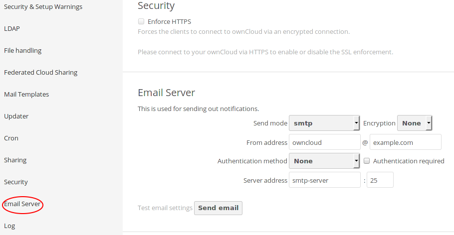

..  Copyright (c) 2015 Hong Xu <hong@topbug.net>

..  This file is part of Blowb.

    Blowb is a free document: you can redistribute it and/or modify it under the terms of the GNU General Public License
    as published by the Free Software Foundation, either version 2 of the License, or (at your option) any later
    version.

    Blowb is distributed in the hope that it will be useful, but WITHOUT ANY WARRANTY; without even the implied warranty
    of MERCHANTABILITY or FITNESS FOR A PARTICULAR PURPOSE.  See the GNU General Public License for more details.

    You should have received a copy of the GNU General Public License along with Blowb.  If not, see
    <http://www.gnu.org/licenses/>.

OwnCloud, A File Synchronization and Cloud Service
==================================================

*Uses a data container, dnsmasq, MariaDB, Nginx, OpenLDAP and Postfix*

`Owncloud`_ is a free, open source, Dropbox-like file synchronization and cloud service.

Configure DNS
-------------

Please add an A record to point the domain you want to use with ownCloud to the IP address of the server.

Configure the MariaDB Database
------------------------------

Please follow the instructions in :doc:`../common-tasks/add-mariadb-database` to create a new user and a database both
named as ``owncloud`` in MariaDB.

Set up OwnCloud Container
-------------------------

Create a data container for ownCloud:
::

   docker run -v /var/www/html --name owncloud-data busybox /bin/true

To start the ownCloud container, run the following command:
::

   docker run -d --restart always --name owncloud --dns $HOST_ADDR \
    --add-host smtp-server:$HOST_ADDR --volumes-from owncloud-data blowb/owncloud

For the first time the container starts will download and decompress the ownCloud installation to ``/var/www/html/``.

Configure Nginx
---------------

Now run the following command to set up Nginx, after replacing ``owncloud.example.com`` with your ownCloud domain:
::

   cd $DOCKER_SHARE/nginx
   OWNCLOUD_URL='owncloud.example.com'
   sudo -s <<EOF
   sed -e "s/@server_name@/$OWNCLOUD_URL/g" redirect-https.conf.tmpl > owncloud.conf
   sed -e "s/@server_name@/$OWNCLOUD_URL/g" \
    -e 's/@web_server@/owncloud:80/g' reverse-proxy.tls.conf.tmpl > owncloud.tls.conf
   EOF

Optionally you can edit ``owncloud.tls.conf`` to use your own TLS/SSL key instead of the dummy key.

Restart the Nginx container:
::

   docker restart nginx

Basic Configuration of OwnCloud
-------------------------------

Visit your ownCloud setup in a browser (e.g. ``https://owncloud.example.com``), and follow the instructions to set up
ownCloud. In the first-run setup page, database type is ``MySQL/MariaDB`` not ``SQLite``; the database server is ``db``;
database login is ``owncloud``; database password is the one we generated earlier; the database name is
``owncloud``. The settings should look like :numref:`firstrun-setup`. Then click ``Finish setup`` to finish the initial
setup.

.. _firstrun-setup:

.. figure:: owncloud/firstrun-setup.png
   :alt: OwnCloud First Run Setup
   :scale: 40 %

   Set up ownCloud in the first run.

You should now automatically log into your admin account. Then we need to configure the email server for sending
notification.  Click on the triangle on the right up corner, and click "Admin", as shown in :numref:`enter-admin`. This
should lead you to the admin interface.

.. _enter-admin:

.. figure:: owncloud/enter-admin.png
   :alt: Enter Admin
   :scale: 60%

   Enter admin interface.

In the admin interface, there is an "Email Server" section. "Send mode" should be ``smtp``; "From address" can be
anything you like (e.g. ``owncloud@example.com``); "Server address" should be ``smtp-server``. The settings should look
similar to :numref:`email-server`.

.. _email-server:

   Set email server.

Since we use reverse proxy for the ownCloud setup, we also need to configure ownCloud to recognize reverse proxy by
running the following command on the host system (after replacing ``owncloud.example.com`` with the domain you use with
the ownCloud instance):
::

   docker exec -i owncloud bash -c 'cat >>/var/www/html/config/config.php' <<'EOF'
   # reverse proxy settings
   $CONFIG = array_merge($CONFIG, array (
   "overwritehost"     => "owncloud.example.com",
   "overwriteprotocol" => "https",
   ));
   EOF

.. _use-owncloud-with-openldap:

Use OwnCloud with OpenLDAP
--------------------------

It is optional but recommended to use ownCloud with OpenLDAP. If you decide not to use ownCloud with OpenLDAP, you may
skip this part.

First, please follow the instructions in :doc:`../common-tasks/group-tasks-openldap` to create a new group ``owncloud``
and add all users which will be granted to use this service to this group.

Now log in ownCloud with your admin account. On the left up corner, click on the small triangle next to the word
"Files", then click "Apps", as shown in :numref:`enter-apps`.

.. _enter-apps:

.. figure:: owncloud/enter-apps.png
   :alt: OwnCloud Enter Apps

   Enter "Apps" in ownCloud.

You should be in the "Apps" interface now. Click on "Not Enabled" on the left, and find "LDAP user and group backend" on
the right panel. Click on the "Enable" button to enable this LDAP backend ownCloud app, as shown in :numref:`apps`.

.. _apps:

.. figure:: owncloud/apps.png
   :alt: OwnCloud Apps

   Enable the LDAP backend app.

Enter the admin interface as shown in :numref:`enter-admin`.

In the admin interface, we are going to set up the LDAP server. In the "Server" tab, fill in the ``host`` field with
``ldap``, ``Base DN`` field with ``$LDAP_SUFFIX``, where ``$LDAP_SUFFIX`` should be replaced by the ``$LDAP_SUFFIX``
used in :doc:`../install-essential-docker/openldap`. ``User DN`` and ``Password`` should be left empty. The setup should
look like :numref:`ldap-server`.

.. _ldap-server:

.. figure:: owncloud/ldap-server.png
   :alt: LDAP "Server" Tab

   Fill in the "Server" tab in LDAP settings panel.

Fill in the "User Filter" tab as in :numref:`ldap-user-filter` and "Login Filter" tab as in
:numref:`ldap-login-filter`. In the "Login Filter" tab, you may also add some other attributes as user login. Other tabs
can be left as default.

.. _ldap-user-filter:

.. figure:: owncloud/ldap-user-filter.png
   :alt: LDAP "User Filter" Tab

   Fill in the "User Filter" tab in LDAP settings panel.

.. _ldap-login-filter:

.. figure:: owncloud/ldap-login-filter.png
   :alt: LDAP "Login Filter" Tab

   Fill in the "Login Filter" tab in LDAP settings panel.

Other Settings
--------------

You may adjust settings and add more ownCloud apps to your installation. The way to add a new app into your ownCloud
installation is similar to adding the LDAP backend app as shown in :ref:`use-owncloud-with-openldap`. It is recommended
to enable the `Calendar <https://doc.owncloud.org/server/8.0/user_manual/pim/calendar.html>`_ and `Contacts
<https://doc.owncloud.org/server/8.1/user_manual/pim/contacts.html>`_ apps to synchronize your calendar and contacts.

Update OwnCloud
---------------

The ownCloud container used here is a self-managed php container, which means that all ownCloud related files are
actually downloaded and stored in a data container during the ownCloud container's first run. To upgrade, you can use
`ownCloud's Updater app <https://doc.owncloud.org/server/8.0/admin_manual/maintenance/update.html>`_.

To manually update ownCloud, run the following command to enter the shell in the ownCloud container then switch to
``/var/www/html``:
::

   ne owncloud
   # Now in the owncloud container
   cd /var/www/html

Then follow `the official instruction
<https://doc.owncloud.org/server/8.0/admin_manual/maintenance/upgrade.html#manual-upgrade-procedure>`_ to update.

.. _OwnCloud: https://owncloud.org
