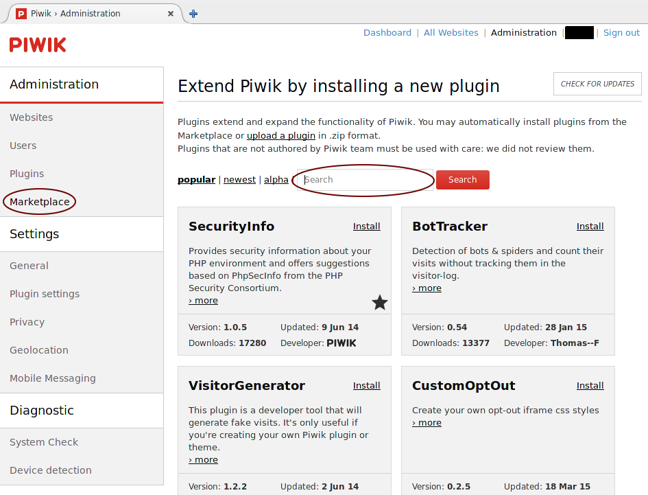
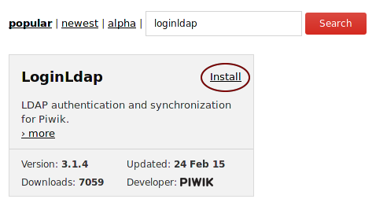
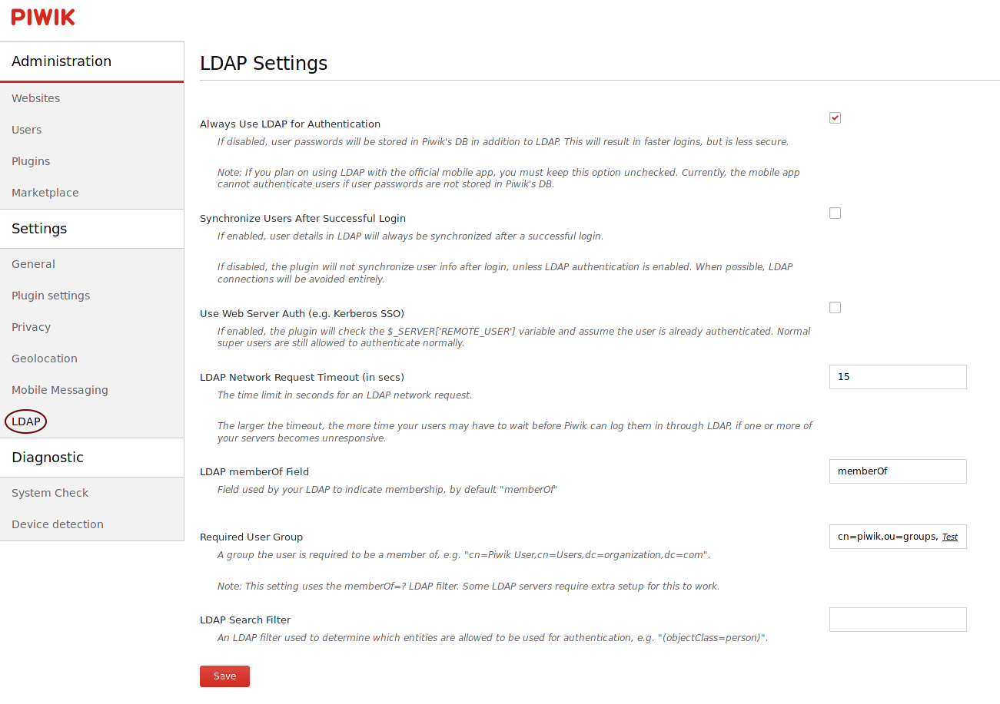
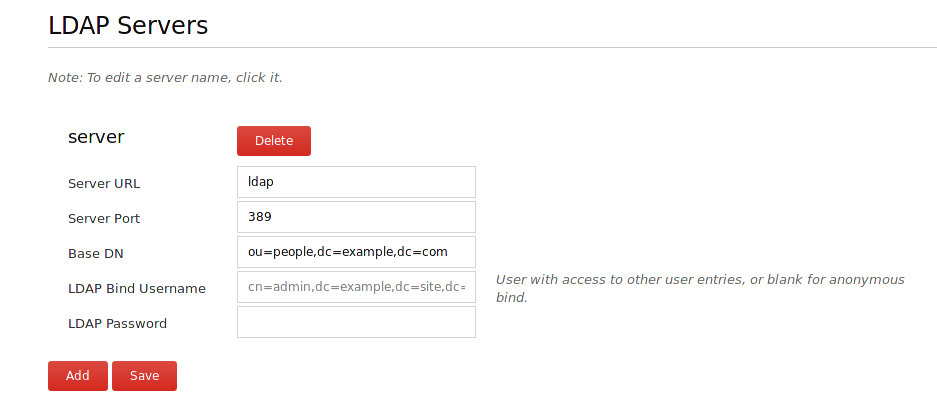
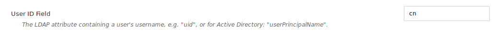

..  Copyright (c) 2015 Hong Xu <hong@topbug.net>

..  This file is part of Blowb.

    Blowb is a free document: you can redistribute it and/or modify it under the terms of the GNU General Public License
    as published by the Free Software Foundation, either version 2 of the License, or (at your option) any later
    version.

    Blowb is distributed in the hope that it will be useful, but WITHOUT ANY WARRANTY; without even the implied warranty
    of MERCHANTABILITY or FITNESS FOR A PARTICULAR PURPOSE.  See the GNU General Public License for more details.

    You should have received a copy of the GNU General Public License along with Blowb.  If not, see
    <http://www.gnu.org/licenses/>.

Piwik, A Web Analytics Platform
===============================

`Piwik`_ is a free web analytics platform which you can install on your own server.

Configure DNS
-------------

Please add an A record to point the domain you want to use with Piwik to the IP address of the server.

Configure the MariaDB Database
------------------------------

Please follow the instructions in :doc:`../common-tasks/add-mariadb-database` to create a new user and a database both
named as ``piwik`` in MariaDB.

Set up Piwik Container
----------------------

Create a data container for Piwik:
::

   docker run -v /var/www/piwik --name piwik-data busybox /bin/true

To start the Piwik container, run the following command:
::

   docker run -d --restart always --name piwik --link mariadb:db --link openldap:ldap \
    --volumes-from piwik-data blowb/piwik

For the first time the container starts will download and decompress the Piwik installation to ``/var/www/piwik``.

Set up Nginx
------------

Now run the following command to set up Nginx, after replacing ``piwik.example.com`` with your Piwik domain:
::

   echo --link piwik:piwik >> ~/util/nginx-links.txt
   echo --volumes-from piwik-data >> ~/util/nginx-volumes.txt
   cd $DOCKER_SHARE/nginx
   PIWIK_URL='piwik.example.com'
   sudo -s <<EOF
   sed -e "s/@server_name@/$PIWIK_URL/g" \
    -e 's/@root@/piwik/g' \
    -e 's/@fastcgi_server@/piwik:9000/g' fastcgi.conf.tmpl >piwik.conf
   sed -e "s/@server_name@/$PIWIK_URL/g" \
    -e 's/@root@/piwik/g' \
    -e 's/@fastcgi_server@/piwik:9000/g' fastcgi.tls.conf.tmpl >piwik.tls.conf
   EOF

Restart the Nginx container:
::

   ~/util/rerun-nginx.sh

Configure Piwik
---------------

Visit your Piwik setup in a browser (e.g. ``https://piwik.example.com``), and follow the instructions to set up
Piwik. In the database setup page, remember in our setup, the database server is ``db``, database login is ``piwik``,
database password is the one we generated earlier, database name is ``piwik``. The table prefix can be any thing, even
empty.

Use Piwik with OpenLDAP
-----------------------

It is optional to use Piwik with OpenLDAP. If you decide not to use Piwik with OpenLDAP, you may skip this part.

Please follow the instructions in :doc:`../common-tasks/group-tasks-openldap` to create a new group ``piwik`` and add
all users which will be granted to use this service to this group.

First we need to install the `LoginLdap plugin <https://plugins.piwik.org/LoginLdap>`_ . To install the plugin, log into
your Piwik instance, click the ``Administration`` link on the top right corner and click the ``Marketplace`` link. You
should now see an interface similar to :num:`figure #piwik-marketplace`.

.. _piwik-marketplace:

Then in the searchbox, search for ``LoginLdap``, and you should now see that the LoginLdap shows up in the plugin panel
as shown in :num:`figure #piwik-marketplace-ldaplogin`.

.. _piwik-marketplace-ldaplogin:

After that, click on the ``install`` link to install the plugin. If the installation is successful, you can click on the
``Activate`` link to activate the plugin. Alternatively, you may follow the `Piwik plugin installation guide
<https://piwik.org/faq/plugins/#faq_21>`_ and `LoginLdap installation guide
<https://github.com/piwik/plugin-LoginLdap#installation>`_ to install and activate the LoginLdap plugin.

After activating the LoginLdap plugin, you should be able to see an ``LDAP`` link in the administration panel as shown
in :num:`figure #piwik-ldap`.

.. _piwik-ldap:

Click the link, then you will see a list of LDAP settings on the right, as shown in :num:`figure #piwik-ldap`. Then make
sure your LDAP server settings are similar to the settings in :num:`figure #piwik-ldap-server`, (replace
``dc=example,ec=com`` with the ``$LDAP_SUFFIX`` in :doc:`../install-essential-docker/install-openldap` in the "Base DN"
field) then click ``Save``.

.. _piwik-ldap-server:

Change the "User ID Field" to `cn` as shown in :num:`figure #piwik-ldap-uid`, then click the save below it.

.. _piwik-ldap-uid:

Make sure the rest of the settings looks similar to :num:`figure #piwik-ldap`. Note that your "Required User Group"
should be ``cn=piwik,ou=groups,dc=example,dc=com``, where ``dc=example,dc=com`` should be replaced by the
``$LDAP_SUFFIX`` in :doc:`../install-essential-docker/install-openldap`. Click on the ``Test`` link in the "Required
User Group" box to make sure the configuration is correct. Then click ``Save``.

The configuration above is the recommended settings, but you may follow `LoginLdap configuration guide
<https://github.com/piwik/plugin-LoginLdap#configurations>`_ to configure the plugin differently.

Update Piwik
------------

The Piwik container used here is a self-managed php container, which means that all Piwik related files are actually
downloaded and stored in a data container during the Piwik container's first run. To upgrade, you can use Piwik's
builtin auto updater.

To manually update, run the following command to enter the shell in the Piwik container then switch to ``/var/www``:
::

   ne piwik
   # Now in the Piwik container
   cd /var/www

Then follow the `manual update instructions <https://piwik.org/docs/update/>`_ to update.

.. _Piwik: https://piwik.org
